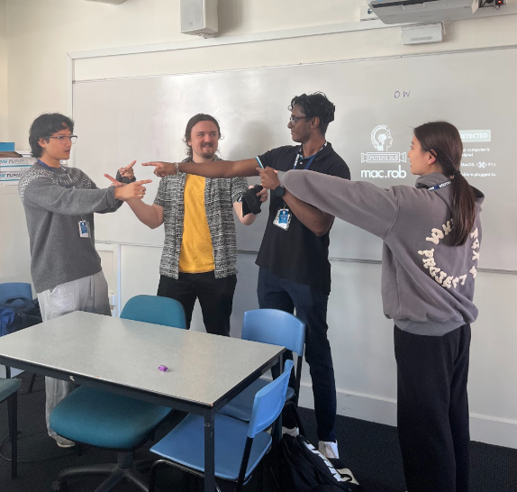

# How to Research & Choose Schools

Let’s be real – **getting a school to say yes is hard.** Not gonna lie, most of the time, you'll be hitting up schools and getting nothing but radio silence. Emails go unread, phone calls get transferred around, and sometimes, you’ll never hear back.

But that’s the game. Schools are busy, and MDN Education isn’t always their top priority.  
**That doesn’t mean you stop trying. It just means you’ve gotta be smart about how you reach out.**

## 🎯 Start with Your Own Connections

Before you start cold emailing random schools, use what you’ve got.  
**Personal connections** will always be the **easiest way to get a foot in the door.**

✅ **Your Old High School** – Teachers love seeing their ex-students thriving.  
Hit up a teacher who knew you, or the school’s STEM/IT department. Even if you weren’t a STEM kid, any teacher who had an impact on you is worth reaching out to.

✅ **Friends & Family** – Does your sibling’s school have an IT program? No siblings? No worries. Maybe your cousin’s school has a robotics club, or your friend’s little sibling’s school has a Legal Studies class that would be perfect for an AI ethics workshop? Don’t be afraid to leverage your network.

✅ **Past MDN Workshop Schools** – If we’ve run a workshop at a school before, chances are, they’ll be open to another one. Check the Notion page to see where we’ve already been and follow up with past contacts.

  

  

## 🔍 How to Pick the Right Schools

If you’ve exhausted your connections, it’s time to do some research.  
**The goal is to find schools where our workshops will make an impact** – not just cold email every school in Australia.

✅ **Check School Type & Relevance** – Is it public or private? Primary or secondary? Do they already have AI, tech, or ethics programs that align with what we offer/what we can offer?

✅ **Look for Existing STEM/AI Initiatives** – If they have a robotics club, coding program, or even ethics classes, they’re more likely to say yes because our content fits naturally into what they already do.

✅ **Find the Right Contact Person** – Generic school emails (like info@school.com) are usually black holes where emails go to die.  
Instead, try to find a specific person who would care about AI education. Some people that we have found are best to contact are:

- **STEM/IT Teachers** – The easiest in for AI-focused workshops.
- **Ethics/Legal Studies Teachers** – If we’re pitching AI ethics and law workshops.
- **Extracurricular Coordinators** – They handle guest speakers & programs.
- **Careers/Pathways Advisors** – If the school focuses on AI/tech careers, they might be keen.

✅ **[Use the MDN School Research Template](https://docs.google.com/document/d/13C8n0W-Q6i1ogG-wT5IrFzrbZCB-6IDX0E4hJbU9yv0/edit?usp=sharing)** – Before reaching out, make sure your team has a Notion page to track school outreach. This prevents multiple people from contacting the same school, which can come off as unprofessional and disorganized. Keep it clean, keep it coordinated.
