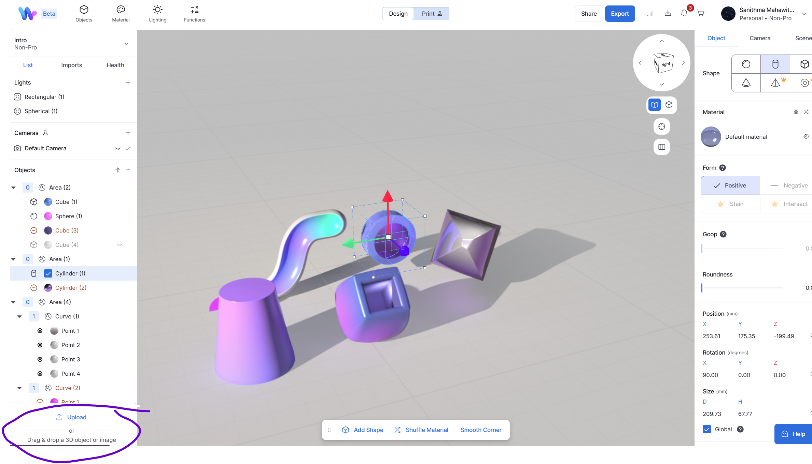
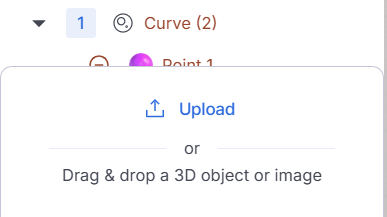
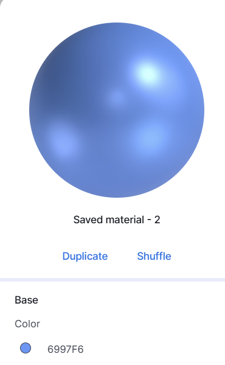
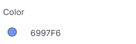

    <h1 style="color:#5833ff;">Full Model Creation Walkthrough</h1>

  <b>Here we will provide an insight into the thought process when approaching the creation of a more complex 3d model<b>

  <b>Walkthrough Video... <b>

  <iframe width="640" height="400" src="https://www.youtube.com/embed/AxGqFgbC7VQ" 
          frameborder="0" allow="accelerometer; autoplay; encrypted-media; gyroscope; picture-in-picture" 
          allowfullscreen>
  </iframe>

  <b>Number 1 Tip: Upload a reference image before getting started! This is located under the layers panel!<b>

<figure>
          
          
</figure>

<figure>
          
          
</figure>

  <b>Number 2 Tip: Extract hex code colors from reference image to use when creating the materials for your objects! Use a website like: https://imagecolorpicker.com/<b>

<figure>
          
          
</figure>

<figure>
          
          
</figure>

