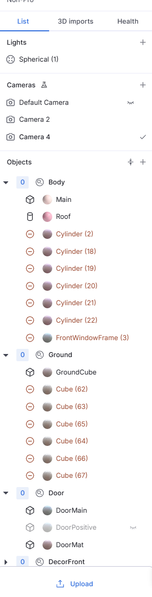
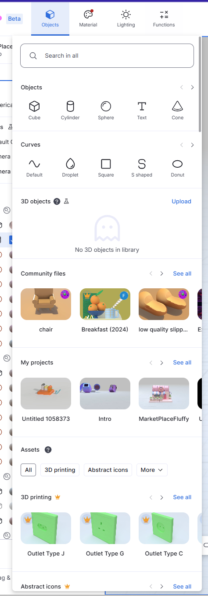
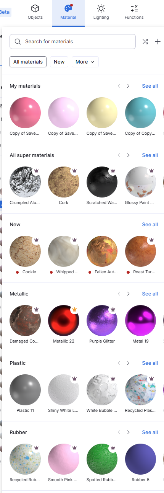
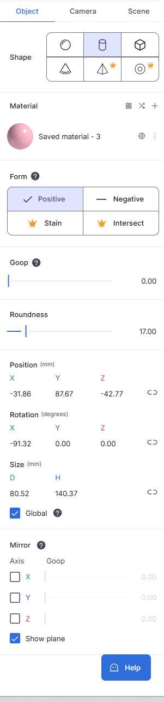

    <h1 style="color:#5833ff;">Interface Walkthrough</h1>

  Let's take a tour of womp 3d's workspace...(video) 

  Summary of Womp's workspace - These are the sections you will interact with the most...

  - Layers

<figure>
          
          
</figure>

  - Shapes

<figure>
          
          
</figure>

  - Material Settings

<figure>
          
          
</figure>

  - Shape Settings

<figure>
          
          
</figure>

