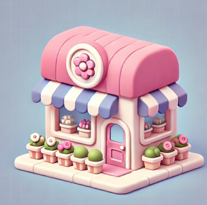
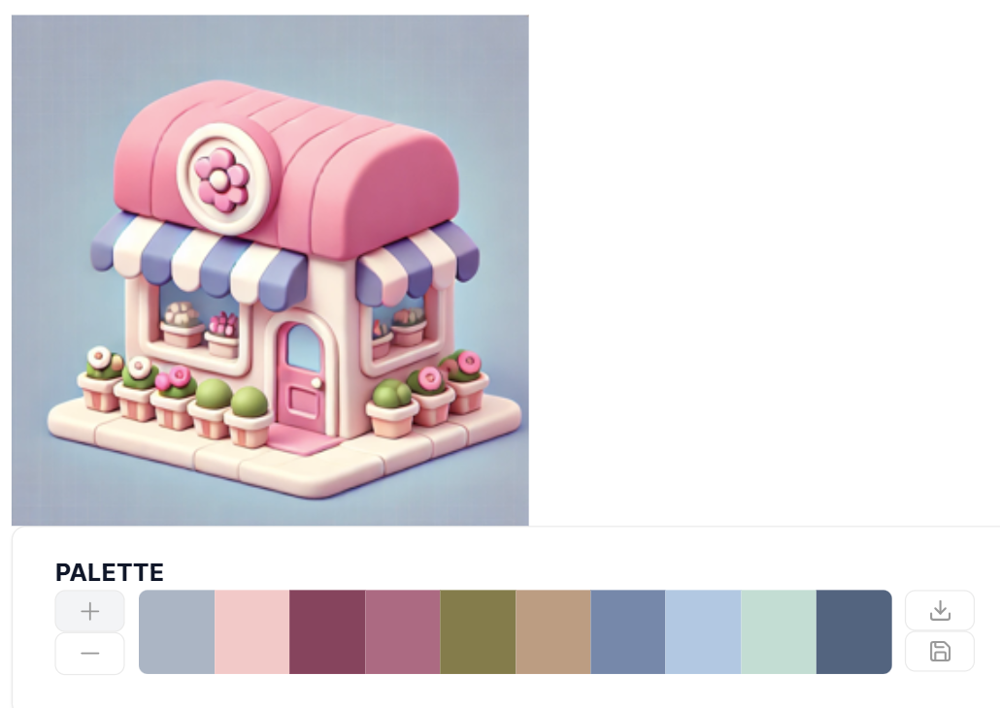
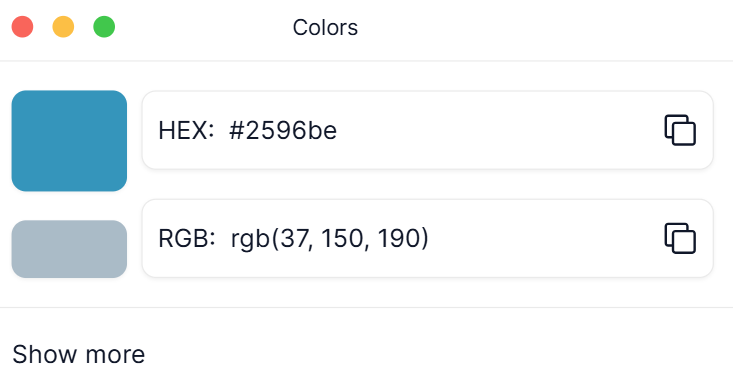
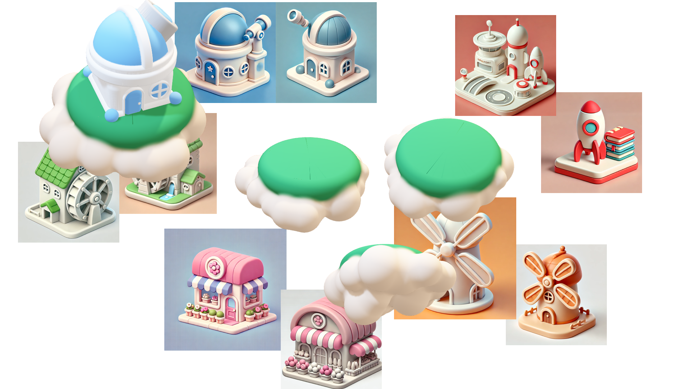

    <h1 style="color:#5833ff;">Getting Started - MoodBoard First!</h1>

  Establishing the vision for your 3d model is the best time saver!

  Chatgpt is a useful tool to generate inspo images for your moodboard! We encourage you to use chatgpt to generate as many reference images as you need before you begin modelling. For the 3d model you aim to make first IDENTIFY...

<b> - THE STYLE </b>

    <b>E.g Could be cute and fluffy 🎀💐 </b>

  <figure>
    
    
  </figure>

    <b>E.g Could be glassy and sleek</b>

<figure>
  
  
</figure>

<b> - THE COLOUR PALETTE 🎨🖼️</b>

   This allows you to easily reference the hex codes when you are creating your models. 

<figure>
  
  
</figure>

<figure>
  
  
</figure>

    <b>Color Picker Website:  </b>

<b> - OVERALL NARRATIVE/CONCEPT </b>

   Create your final mood board 

<figure>
  
  
</figure>

