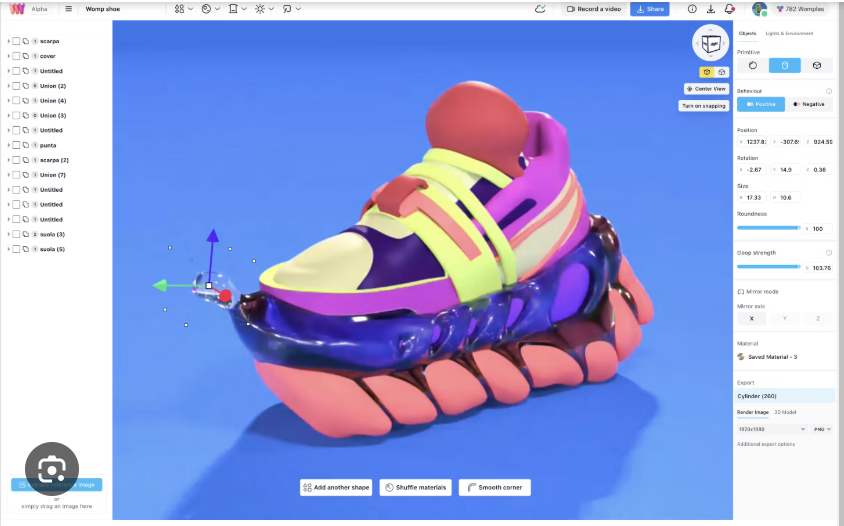

<h1 style="color:#4818d8;">✨Intro to 3D Modelling✨</h1>

Beginner friendly method!  

3D models are incredible tools for bringing ideas to life, but why stop at using premade designs? By creating your own custom 3D models, you unlock unlimited creative freedom and add a unique, personal touch to your projects. Whether you're designing for a workshop, a project, or just for fun, custom 3D modeling allows you to stand out and bring your vision to reality like never before!

<figure>
          
          
</figure>

