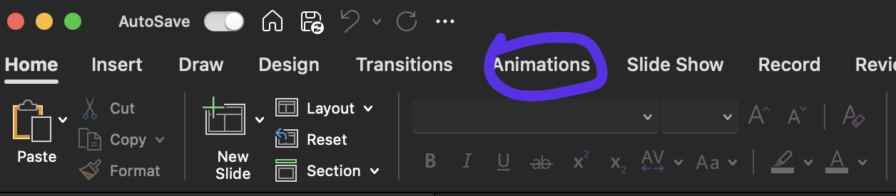
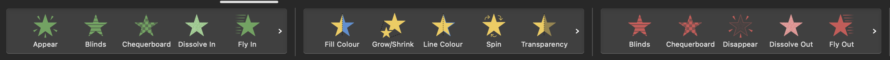
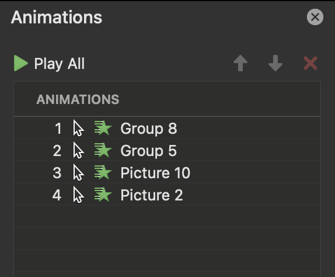

# Animations

<div align="center">
    <iframe width="640" height="400" src="https://www.youtube.com/embed/UYrFO3PWcLU" frameborder="0" allow="accelerometer; autoplay; encrypted-media; gyroscope; picture-in-picture" allowfullscreen></iframe>
</div>


---

```admonish note title="Animations", class="custom-4 custom-1"
Visual effects that can be applied to text, images, shapes, and other elements on a slide.
```

These help create visual interest.

<figure>
  
</figure>


```admonish example title="" 
<span style="color: white; font-weight: bold;">Entrance</span>

For any asset you want to bring into/introduce into the frame.

<span style="color: white; font-weight: bold;">Emphasis</span>

Moves existing assets in the frame.

<span style="color: white; font-weight: bold;">Exit</span>

For any asset you want to remove from the frame.

```

<figure style="text-align: center;">
  
  <figcaption>Entrance, Emphasis and Exit animations (left to right)</figcaption>
</figure>


The animation pane helps you see the order of animations- you can utilise this to be deliberate with order. 

<figure style="text-align: center;">
  
  <figcaption>Animation Pane</figcaption>
</figure>


```admonish warning title="Note"
**Be careful** not to distract with your animations- they should enhance the existing content.
```