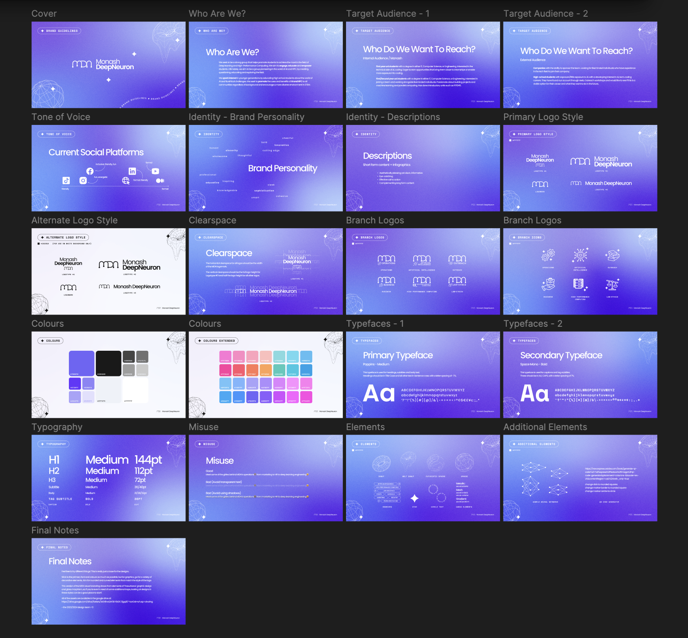

# Design Language

Design language is the set of visual elements, principles, and rules that define a PowerPoint's look and feel (within the context of workshops).

It it crucial that all PowerPoints have a <ins>consistent</ins> design language (unless the nature of the workshop requires otherwise) as this helps us make the presentation more aesthetic.

Fortunately, as an MDN member, there is not much work required from your end since our Marketing team has already made an [**MDN Brand Guide (Figma)**](https://www.figma.com/design/iKeXPDst2rOSixPH4cdOFY/MDN-Brand-Kit)

[**Click here to use the MDN Brand Guide (GDrive)**](https://drive.google.com/drive/u/4/folders/1BdJdZeJcvKBNRaSnMc5dYoFNmx9-wRc5)

<figure style="text-align: center;">
  
  <caption>MDN Brand Kit</caption>
</figure>

This brand kit is quite comprehensive on MDN's visual identity. 

Use the navigation bar to move through the guide. 

You are to adhere to this guide as strictly as possible when designing your slides (i.e. copy the logo components, colours, typography etc). 
