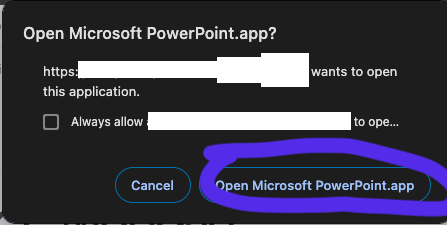

# Editing

<div align="center">
    <iframe width="640" height="400" src="https://www.youtube.com/embed/0EcYtMPKz9A" frameborder="0" allow="accelerometer; autoplay; encrypted-media; gyroscope; picture-in-picture" allowfullscreen></iframe>
</div>


Since all PowerPoints are shared using OneDrive, when you initially click the link to the PowerPoint, you will be taken to the **web app** version of the presentation.


```admonish warning title="Note"
**AVOID** making changes on your browser (i.e. web app).

Use PowerPoint desktop app instead
```

The desktop app is more powerful and robust (less buggy).

---

Begin by finding the '**Editing' Button** on your powerpoint ribbon (usually top right)

<div style="text-align: center;">
  <figure>
    
  </figure>
</div>

From the dropdown, select **'Open in Desktop'**

<div style="text-align: center;">
  <figure>
    
  </figure>
</div>

Your browser will then prompt you to open the presentation using your desktop PowerPoint application. 

Select **'Open Microsoft Powerpoint.app'** or the respective button on your device.

<div style="text-align: center;">
  <figure>
    
  </figure>
</div>

Your device will now open the presentation on the actual PowerPoint desktop application. 

Do all your editing here.

<div style="text-align: center;">
  <figure>
    
  </figure>
</div>
