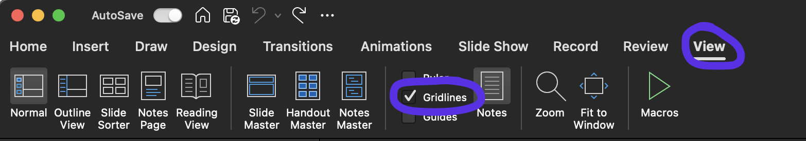
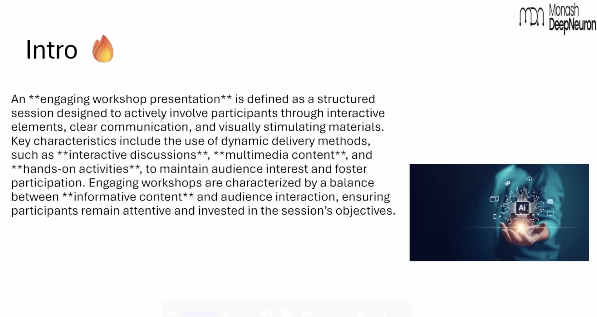

# Formatting

<div align="center">
    <iframe width="640" height="400" src="https://www.youtube.com/embed/m0RD5JsXAOI" frameborder="0" allow="accelerometer; autoplay; encrypted-media; gyroscope; picture-in-picture" allowfullscreen></iframe>
</div>


---
```admonish note title="Formatting", class="custom-4 custom-1"
The organisation of assets on a slide/s (text, images, etc).
```

## Text

```admonish warning title="Note"
Avoid massive chunks of text.
```

Use dot points to summarise big lengths of text. 

Spread across slides if needed to reduce text on each individual slide.

Utilise text size, bolding and underlines to emphasize and diminish key points.

## Images

Ensure all images on your slides have the same formatting (corners, shadows etc).

## Alignment

In pptx, go to **View → <input type="checkbox" id="Gridline" checked> Gridline<br>**

<figure>
  
</figure>

Use this to align all your elements within those gridlines so that all assets look in line and proportionate. 

```admonish example 
<p align="center">
  <figure style="display:inline-block; margin-right: 10px;">
    
    <figcaption>Bad formatting</figcaption>
  </figure>

  <figure style="display:inline-block;">
    
    <figcaption>Good formatting</figcaption>
  </figure>
</p>
```