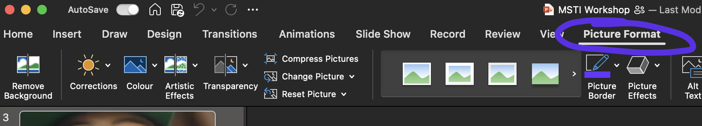
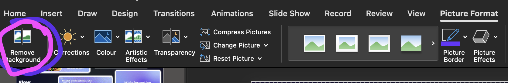

# Images

    <iframe width="640" height="400" src="https://www.youtube.com/embed/1ZtMm6DOZvU" frameborder="0" allow="accelerometer; autoplay; encrypted-media; gyroscope; picture-in-picture" allowfullscreen></iframe>

---

The use of images key during your presentation, since visual information is most easily consumed by your audience. 

Ensure your images are formatted to maximise their effect.

<figure style="text-align: center;">
  
  <figcaption>Select your image → 'Picture Format'</figcaption>
</figure>

Within 'Picture Format' you have a plethora of options to manipulate the original image.

See the video tutorial above for what we specifically do at MDN.

## Removing background

Within 'Picture Format', select 'Remove Background'

  

You can then use the pen to keep and remove portions of the image. This may take some time since PowerPoint presumes areas you want to keep/remove.

  

