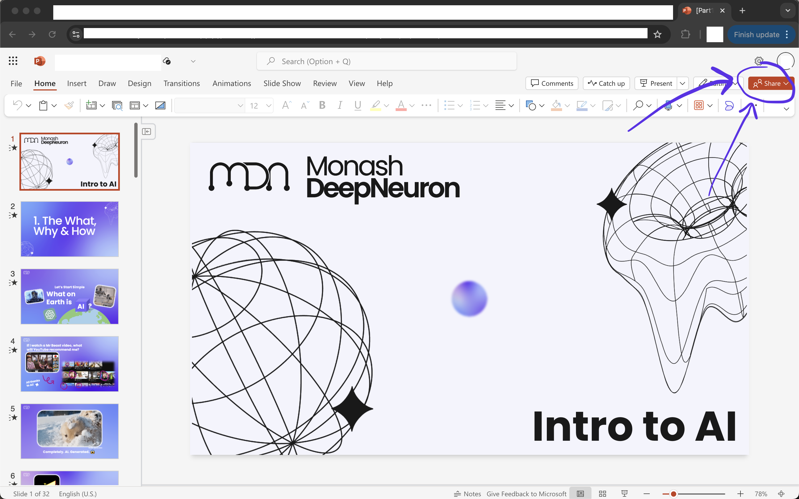
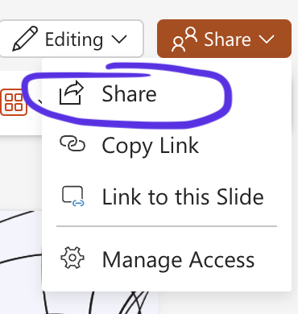
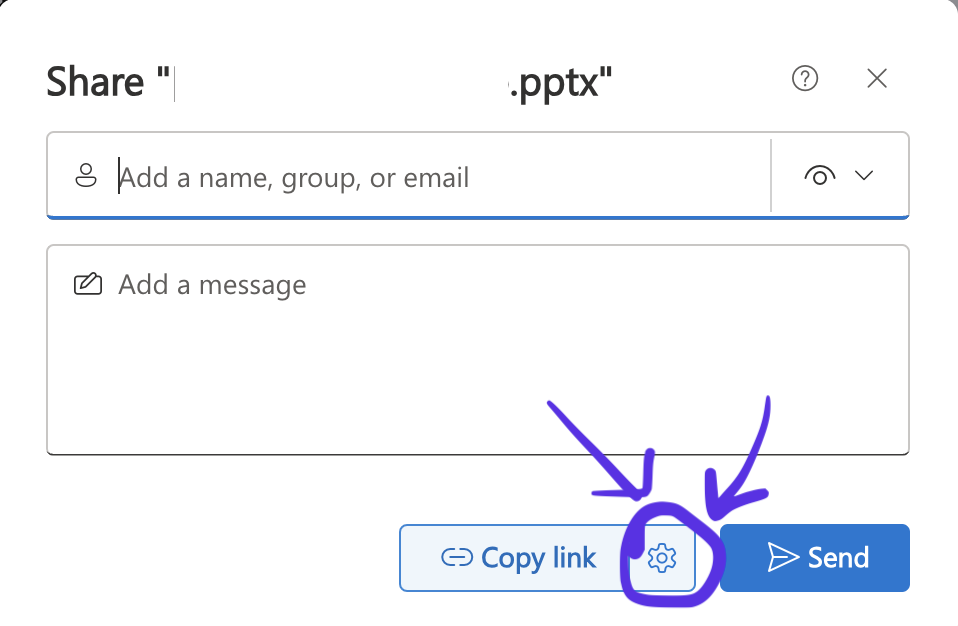
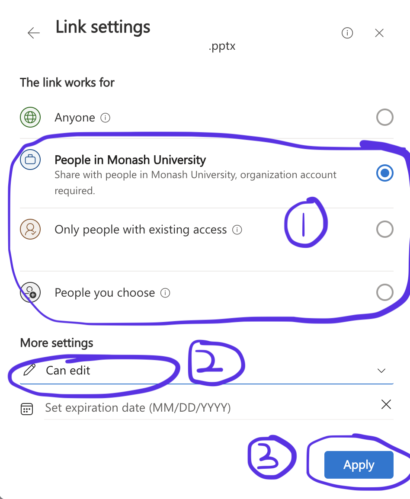
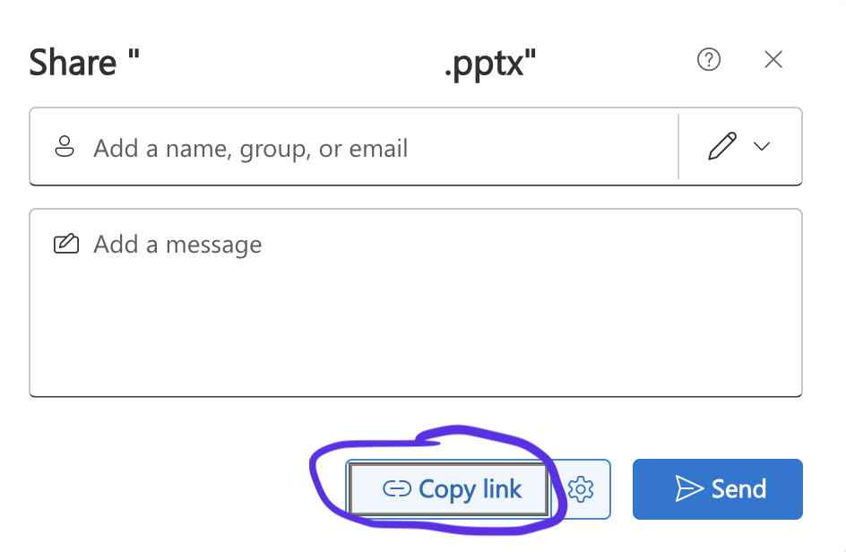

# Sharing

    <iframe width="640" height="400" src="https://www.youtube.com/embed/V5oD3MPaCDY" frameborder="0" allow="accelerometer; autoplay; encrypted-media; gyroscope; picture-in-picture" allowfullscreen></iframe>

Since all PowerPoints are shared using OneDrive, when you initially click the link to the PowerPoint, you will be taken to the **web app** version of PowerPoint.

You may also have already opened the PowerPoint using the actual application on your device.

The process is virtually identical on both the desktop app and web app.

---

Begin by locating the share button in your PowerPoint ribbon and click on it. 
<figure>
  
</figure>

From here, click 'share'

<figure>
  
</figure>

Click the cog wheel icon to the right of 'Copy Link'.

<figure>
  
</figure>

From here, to ensure you share appropriately, check the following things
1. Decide who can access the presentation. You can manually enter each person or share with the entirety of Monash University so you don't need to keep adding people as the project scales. 
2. Decide what powers they can have. You may want them to only be able to edit, view, comment etc.
3. Click 'Apply' to activate those decisions for the link.

<figure>
  
</figure>

Lastly, with all your changes made, click the 'Copy link' button to share the link to your PowerPoint and send link as needed. 

<figure>
  
</figure>

