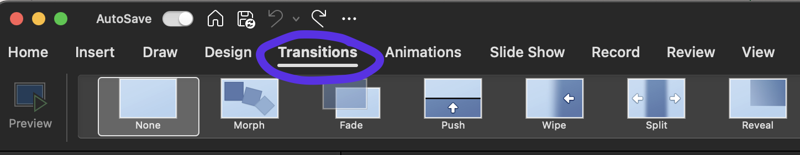
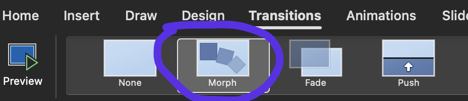

# Transitions

<div align="center">
    <iframe width="640" height="400" src="https://www.youtube.com/embed/dzvYHfXmaEo" frameborder="0" allow="accelerometer; autoplay; encrypted-media; gyroscope; picture-in-picture" allowfullscreen></iframe>
</div>

---

```admonish note title="Transitions", class="custom-4 custom-1"
Special effects that control how a slide enters and how the previous slide exits.
```


Think about transitions like the animation/s between slides. 

There are multiple transitions available using PowerPoint for your use. Feel free to play around with different options to suit your vision and direction in the workshop/presentation. 

<figure>
  
</figure>

## Morph

Morph is our most commonly used transition at MDN.

<figure>
  
</figure>

```admonish note title="Morph", class="custom-4 custom-1"
Transition in PowerPoint which looks for assets (images, text etc) that are on consecutive slides (one after the other), and creates a smooth animation for any changes in those assets (different location, rotated etc) when you move from one slide to the other. 
```


This can create a strong sense of flow and make the assets feel as if they're moving through space rather than being standard presentation slides.

This is particularly cool when rotating 3D assets across consecutive slides.  

See the tutorial video above to see how this is used.