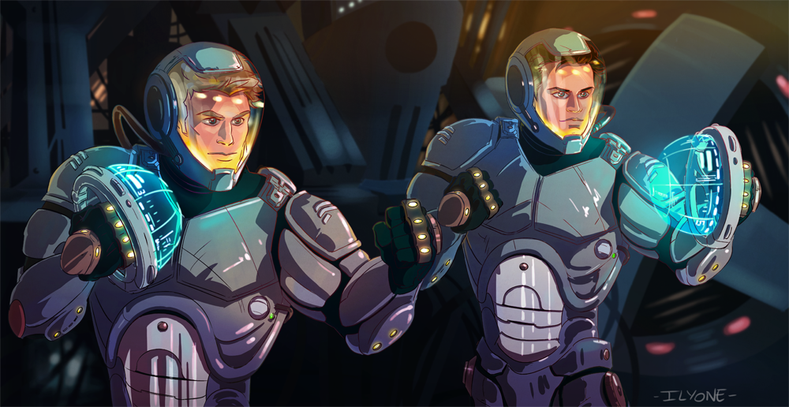

# Philosophy
> “The strongest variable influencing a student’s interest in a subject was the student’s perception of the teacher.”  
> 
> — Dr Shaun Kemp

Think back to that lecture: stale, repetitive, draining. Whether it was high school or university, most of us have felt the life sucked out of a subject by uninspired delivery. It’s like being led on a road trip where you’re given the map but never told the destination. But think about those few classes that pulled you to the edge of your seat. The difference? It was the teacher. The most engaging subjects often had the most passionate educators—a fact that isn’t coincidental, but a core truth in learning.

> “**Every action you take is a vote for the type of person you wish to become.**”  
> 
> — *Atomic Habits*, James Clear

Great teaching isn’t just a skill; it’s an identity, a calling. It’s impossible to teach well without loving the act itself. The best educators are those who show up every day, not just to “teach” but to share in the experience of learning. When we walk into a classroom, we carry the responsibility of shaping not only students’ knowledge but their attitude towards learning itself. Teaching is a vote we cast for a more curious, more engaged world, one class at a time.

> “**You do not rise to the level of your goals. You fall to the level of your systems.**”  
> — *Atomic Habits*, James Clear

To make this philosophy a reality, we need systems that are not just efficient but inspiring. Our goal isn’t just to educate; it’s to cultivate a love of learning. To develop students who are independent, hungry, and always curious. Every lesson should leave them with more questions than answers. We’re not just filling their minds with facts but giving them the tools to explore, question, and solve. With strong systems, we create a sustainable framework that fuels this lifelong curiosity and fosters independence.

---

# Identities of an Education Member

## **The Bridge (Spider-Man)**

As members of the education branch, we are the bridge—like Spider-Man, connecting not only students to knowledge but the entire MDN ecosystem to the spirit of education. This means standing in the gap, understanding and deeply connecting with both our students and our fellow branches. Like Spider-Man, who learns as he grows, we remain open, humble, and always willing to learn from those we teach and those we work with. We’re here to promote humility, foster connection, and ensure that our students and collaborators alike feel supported on their educational journey.
<figure>
  
</figure>

## **The Jaeger**

In our work, we don’t operate as individual pilots but as one united Jaeger. Every class, every project is an “us,” not an “I.” We move in sync, sharing knowledge, strategies, and updates openly so that every branch can see our progress and contributions. By working harmoniously as one, we model a culture of full transparency and trust, creating an environment where all voices are valued, and all updates are shared. We are not just a team; we are a *collective* moving as one to achieve something greater than any single person could.
<figure>
  
</figure>

## **The Hamilton**

We don’t settle for average; we aim to *overperform and overdeliver.* Just like Hamilton, we seize every opportunity to make a lasting impact, producing high-quality content that doesn’t just serve today’s needs but becomes a legacy for future education members. We set a bar that inspires others, putting in the energy and creativity needed to create work that resonates, endures, and serves as a standard for future generations. We lead by example, showing that dedication and performance are not just expectations—they’re commitments we live by.
<figure>
  
</figure>

---

# In Closing

We’re not here to “teach” in the traditional sense. We’re here to empower, to ignite, to revolutionize. Education, when done right, is the strongest force for good, capable of saving minds, expanding horizons, and changing the world. This is our mission. And every student who sits in front of us is a chance to make that vision a reality.

Know that we don’t see ourselves as AI educators, nor HPC educators or programming educators. We’re educators, *period*. As a member of this branch, you have every right and opportunity to go above and beyond, to improve and grow in your skills, in your learning, in your personal life. As much as we transform the world to bring people closer to love and joy of learning, we very much hope that you transform to become the very best version of yourself.