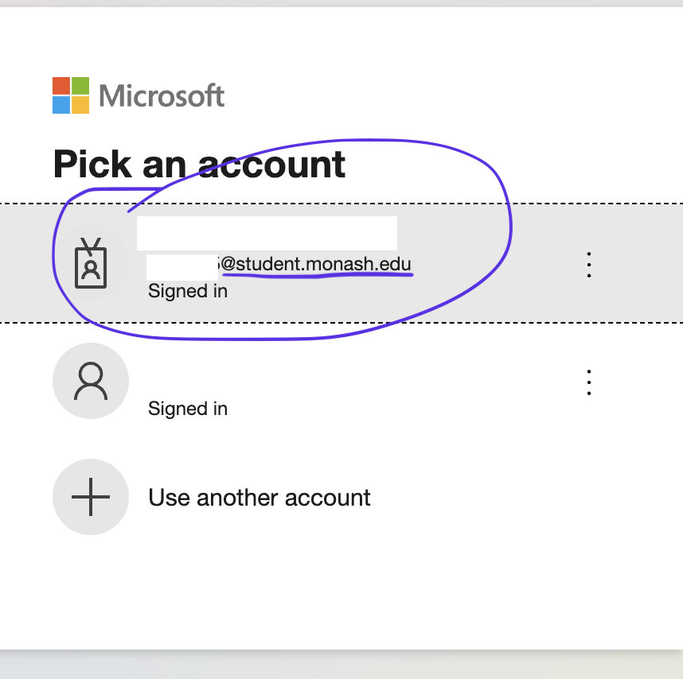
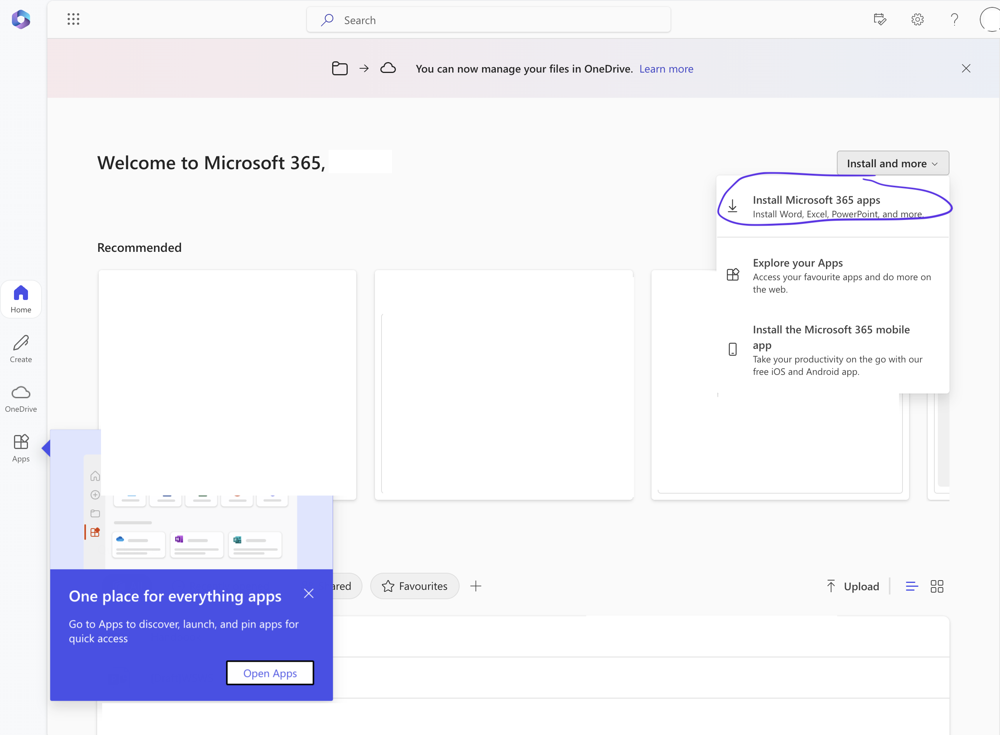
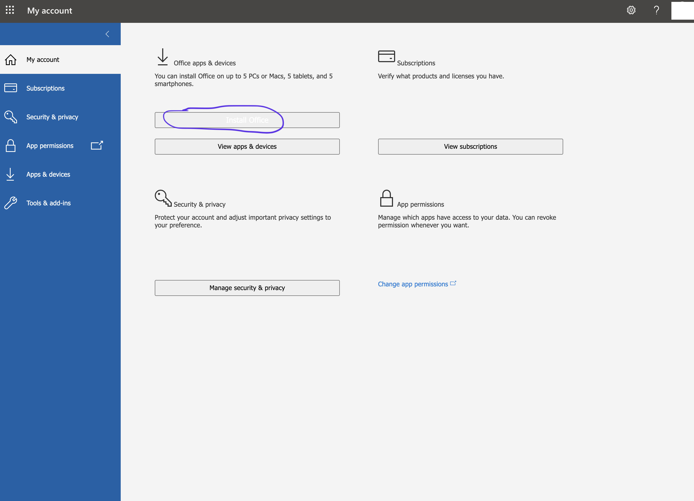

# Office 365

You will need to download Office 365, predominantly for PowerPoint and OneDrive.

Using your PC:
Go to [Microsoft Online](https://login.microsoftonline.com/)

<figure>
  
</figure>

Enter your email address and authcate password. (You should have been automatically redirected to the Monash login page after visiting MS Online)

<figure>
  
</figure>

Now that you have successfully logged in, you will be redirected to the Microsoft Office 365 page.

Download to your personal device.

<figure>
  
</figure>

---

[This](https://www.monash.edu/news/articles/download-microsoft-office-365-for-free) is the official guide from Monash. (N.B. Up to date Nov 2024)

