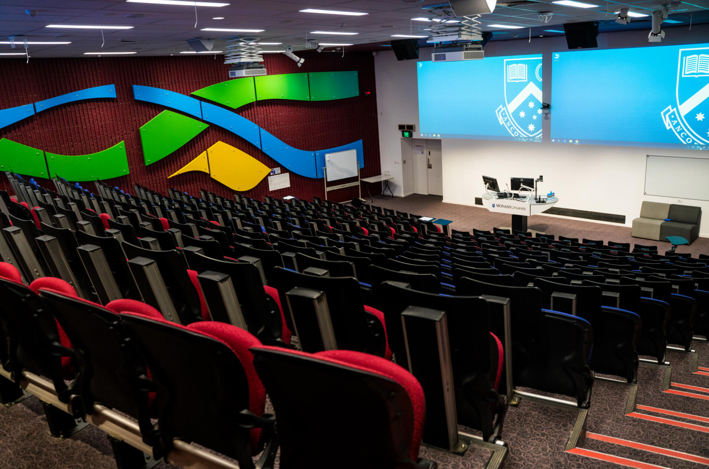

# Location

Your room can have a major impact on the success of the workshop.

Generally, aim to have an open space where there are tables set up for people to collaborate in tables- this is particularly helpful for activities. 

Lighting is also important since it can have a big impact on engagement (poor lighting → more drowsy etc.)

```admonish title="Keys to good workshop location"
1. Open space
2. Tables that enable collaboration
3. Good lighting
```

Ensure it is an area with minimal distraction or potential for a disruption during your workshop.

Try to vet the room if possible before confirming/booking.
<br/><br/>

<figure><center>
  
  <figcaption><center>GOOD example of classroom</figcaption>
</figure>

```admonish title="Why is this a good example of a classroom?", collapsible=true
  The open space allows presenters to walk around. 

  Seperated, circular tables allow for groups to form. This makes it easy to form teams for activities.

  Lots of monitors- slides/content visible from anywhere
```


<figure><center>
  
  <figcaption><center>BAD example of classroom</center></figcaption>
</figure>


```admonish title="Why is this a bad example of a classroom?", collapsible=true
Space directs everyone's attention towards one direction.

Discourages collaboration since members are only able to easily discuss with people to their immediate left and right.

Due to seating design, people at the back see slides less clearly than those towards the front.

Note: This design __may__ be ideal depending on the circumstances of your presentation. It ultimately depends on your goals.
```