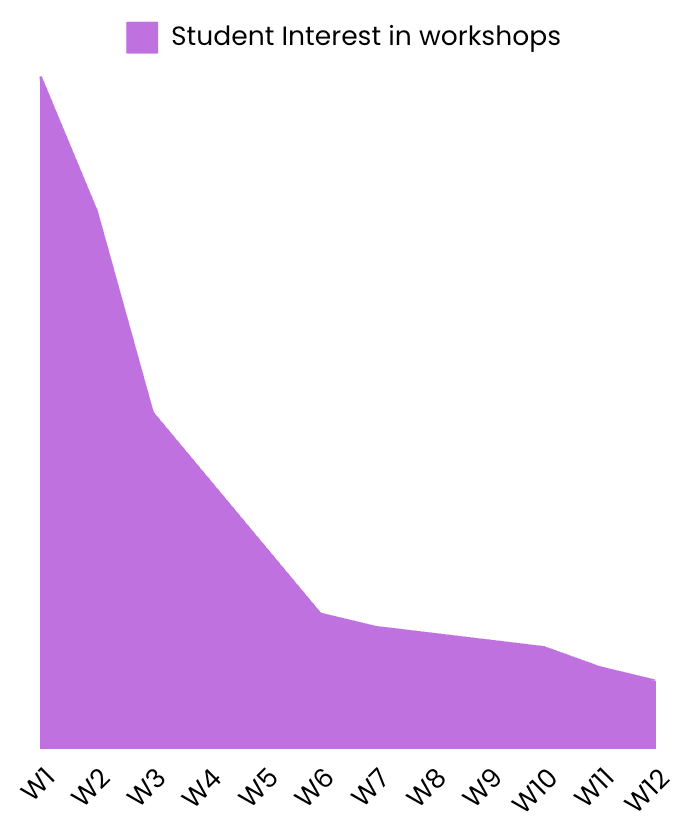

# Timing Strategy

Timing is an often unconsidered component when planning workshops.

## High School Workshops

Keep track of the term dates when planning and prospecting workshops at high schools.

As a general rule, try avoid workshops at the end of the year as motivation for students will likely be very low.

Furthermore, try avoid classes during times where students will likely be less attentive (final periods etc)

## University Workshops
Within the context of university, when planning events:
- Motivation and attendance is highest in the first weeks of semester (W1-6)
- It drops off as the semester progresses

Using this knowledge is crucial.

In our experience, you should aim to position your key, headliner events (in our case: Intro to AI, Intro to HPC etc things of that nature) towards the first 3-4 weeks of semester.

This graph shows a generalised visual of how the interest looks across the sem.

<figure>

  
</figure>

Week 1 in Sem 1 is also a fantastic time to have a lot of jaffies attend if you wish to target that audience.

The later weeks can be used for events where you wish to test ideas or train new members. 

For example, you may hold a new Intro to OS workshop in week 11 to test out new content and see how you go presenting it. You may also choose to have newer education members present in later weeks to get practice without having the pressure to perform with the bigger audiences usually seen in the semester.