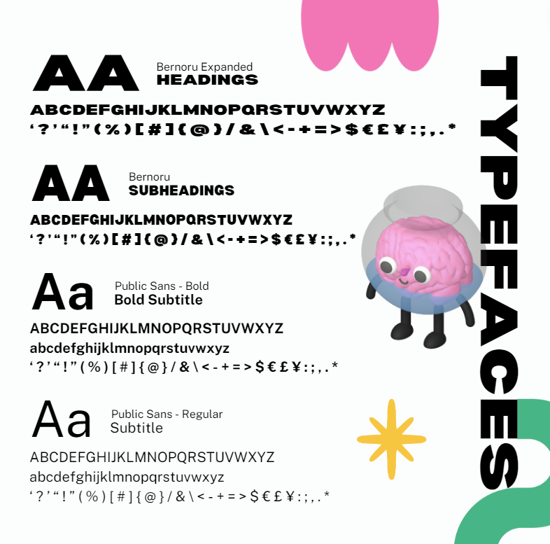
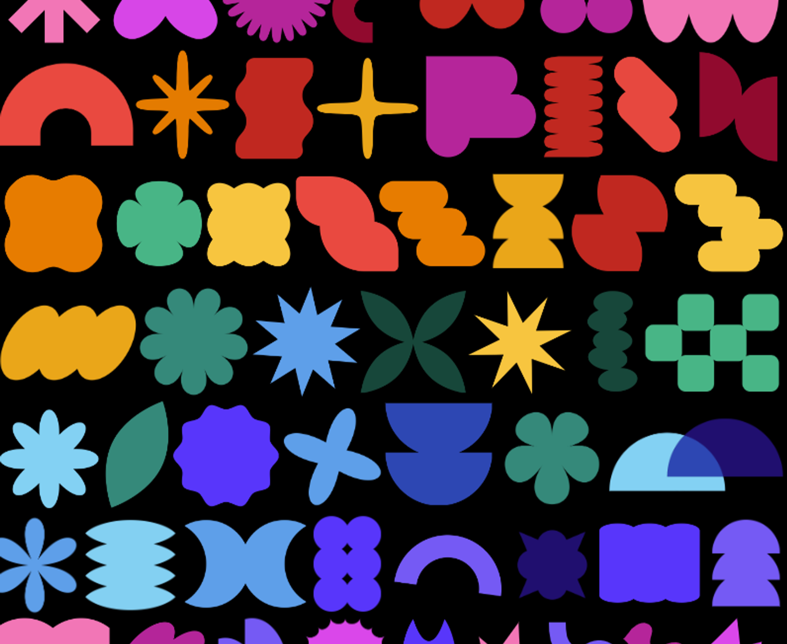

# Aesthetic

We're not saying your **slides should look like a Pixar movie**... actually, why not?  
Imagine smooth animations, vibrant colours, and a design so crisp it deserves an Oscar.  
That’s the goal – and don’t worry, you’ll master the art of slide-making with help from the team.

At the very least, your slides should be **clean, professional, and visually engaging** –  
because let’s be real, no one wants to sit through slides that look like they were thrown together in MS Paint at 3 AM.  
Good design keeps people engaged and makes information easier to digest.

### 💡 What this means:

- Follow the [**MDN branding kit**](https://drive.google.com/drive/u/4/folders/1x6XfirwQW3EV5k0CTjlgqi87-korOdms) – we have it for a reason.

- Keep slides **minimalist** and visually appealing – the less text the better.

- Use **consistent fonts, colours, and icons** – check out our [**Workshop Pitch Deck**](https://monashuni-my.sharepoint.com/:p:/g/personal/jthi0011_student_monash_edu/EXWrzSj965tKj0CawnaQ7ckBM6IeWrOOdhKnDty-ksAfmw?e=Xg4bfo)  
  for an idea of how we do it here at Education.

### 🔍 Ask yourself:

✅ Are my slides **easy to read** and **visually engaging** – have I included enough memes?  
✅ Do they match the **MDN branding kit**?  
✅ Would I **enjoy looking at these** for the duration of the presentation?

### 🎯 Example:

Instead of a **boring title slide**, make it pop with **animations**, **bold colours**, and **large, readable fonts**.  
And please – for the love of good design – **no pixelated images**…  
unless it’s for meme purposes 😏😈

### 🧪 Real-world visual examples

<figure>
  
  <figcaption><em>Example: Utilizing assets and graphics MDN branding kit (animated in powerpoint btw) (AI Workshop)</em></figcaption>
</figure>

<figure>
  
  <figcaption><em>Example: Following the font size and style guidelines from the MDN branding kit (AI Workshop)</em></figcaption>
</figure>

<figure>
  
  <figcaption><em>Example: Typeface guide as specified by the VicHack 2024 branding kit</em></figcaption>
</figure>

<figure>
  
  <figcaption><em>Example: Asset library as provided in the VicHack branding kit</em></figcaption>
</figure>
