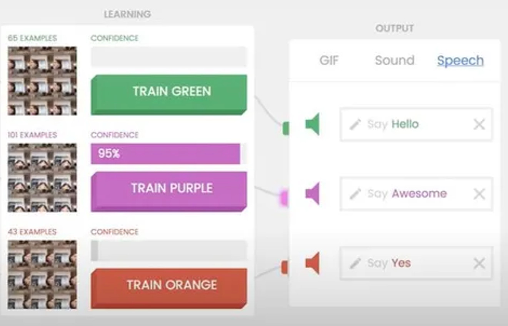
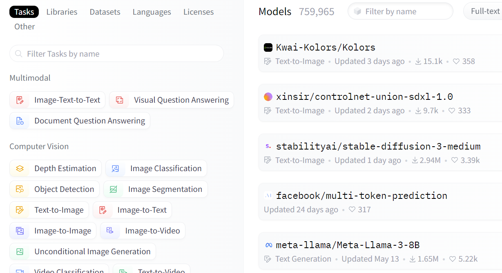

# Engagement

Let’s be real – if people just wanted to listen, they’d speed-run a YouTube lecture at 2x speed.  
**A great workshop isn’t a monologue; it’s an experience.** The more hands–on, the better!

### 💡 What this means:

- At least **a third** of the workshop should be hands-on. 🛠️

- Activities should be **varied** – don’t just rely on Kahoots (even though we love them).  
  Think scavenger hunts, live coding, group challenges, games and more to keep things fresh and engaging.

- If participants walk away feeling like they just sat through a lecture, we’ve missed the mark.  
  **A great workshop should feel interactive**, not like a YouTube tutorial on autoplay.

### 🔍 Ask yourself:

✅ Are attendees **physically or mentally participating**?  
✅ Can you turn any **passive section into an active one**?  
✅ Does the **speaker interact** with at least one audience member every couple minutes?

### 🎯 Example:

**🚫 Passive:** You explain how AI can generate pickup lines while everyone just listens.  
_(Boring. Feels like a TED Talk no one signed up for.)_

**✅ Active:** You challenge students to **battle ChatGPT in a cringy pickup line contest** – who can make the best (or worst) AI-generated pickup line?  
_(Now, they’re engaged, experimenting, and maybe slightly regretting their life choices. Perfect.)_

### 🧪 Real-world application

As a rule of thumb:

> **At least 1/3 of the entire workshop should be purely practical activities**

There are obviously exceptions, but generally, a **1:2 ratio between listening and action** should occur.  
We want participants to be actively engaged during these activities.

<figure>
  
  <figcaption><em>Example: Demonstrate supervised learning with an online model (AI Workshop)</em></figcaption>
</figure>

<figure>
  
  <figcaption><em>Example: Doing a scavenger hunt for particular pre-trained models on Hugging Face (AI Workshop)</em></figcaption>
</figure>
