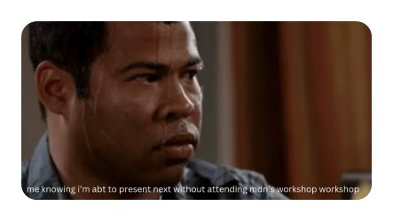
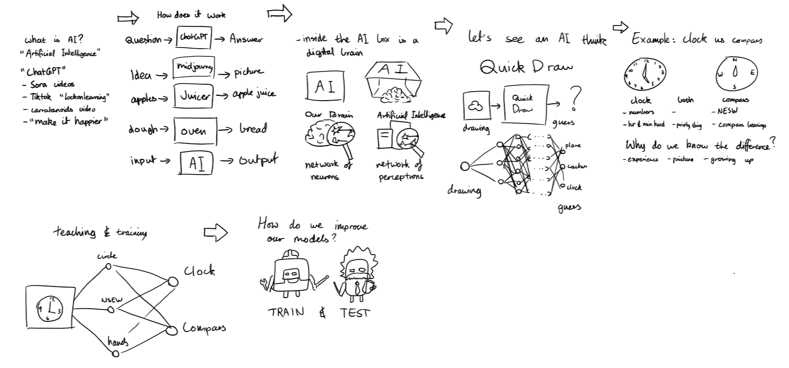
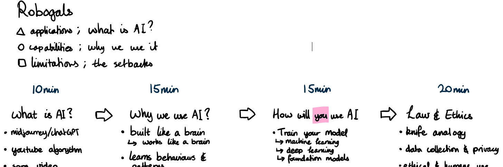

# Flow

**Make it feel like a story, not a lecture!**
Ever read a book that just _flows_ so well you can’t put it down?  
Your workshop should feel like that – but with **less reading and more doing**.

### 💡 What this means:

- The structure should make **logical sense** – no jumping from “What is AI?” straight to “Let’s build a GPT-5 Ultra Pro Max Clone in Verilog” or “Time to code a robotic doctor to perform surgery on my papercut.”  
  Let’s take it one step at a time, yeah?

- It should feel **smooth**, like a well-edited movie. Transitions between topics should be **natural**, not like switching channels on a bad TV signal.

- Use **checkpoints** to keep people on track (polls, questions, mini demos).

### 🔍 Ask yourself:

✅ Does one section flow **smoothly** into the next like a narrative?  
✅ Would someone with **zero context** be able to follow along?  
✅ Are there **natural pauses** to check for understanding?  
✅ Is there **enough discussion** with the audience?

### 🎯 Example:

Instead of dumping all the theory at the start and hoping attendees stay awake, start with **something engaging** – a quick AI demo, a meme, or even a question like _“What’s the dumbest thing an AI has ever said?”_

<figure style="margin-bottom: 0;">
  
</figure>

## ✍️ Narrative Structure in Practice

Each section of the workshop should lead smoothly into the next – like a good story.  
Don’t treat it as separate pieces you just glue together. Think of it as a **narrative arc** – a journey you guide your audience through.

### 🧾 Example of planning the flow of workshop with preliminary schematics

<figure>
  
  <figcaption><em>Example of planning the flow of workshop with preliminary schematics</em></figcaption>
</figure>

### 📋 Real example of workshop structure for high school students

<figure>
  
  <figcaption><em>Real example of workshop with high school students</em></figcaption>
</figure>
