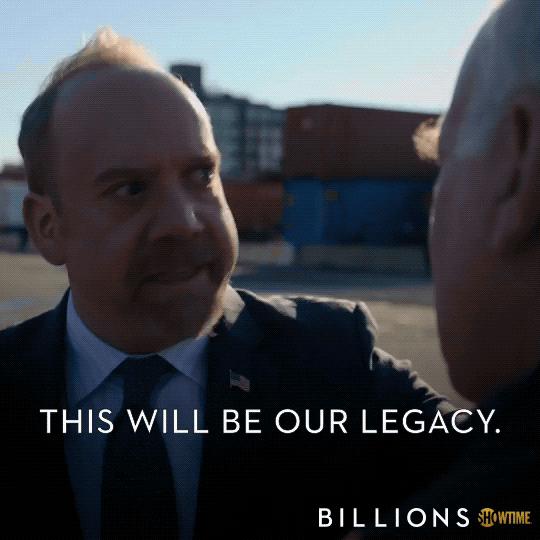

# Legacy

A **great workshop** doesn’t end when the session does – it **sticks with people**.

Legacy is all about ensuring that attendees walk away remembering what they’ve learned, feeling inspired, and maybe even sharing it with someone else.

If your workshop was good, you SHOULD have people you've never met before staying back afterwards chatting to you. That's the kind of lasting impression we aim for.

### 💡 What this means:

- Every workshop should **give attendees something valuable to take away** – whether it’s a project, a new skill, a challenge to complete, or even a quick fact they’ll bring up over dinner.

- The **final section** should **reinforce key takeaways** – leave them with something sticky and impactful.

- And let’s not forget: **feedback is a must**. We’re always looking to improve, and post-workshop insights are pure gold.

### 🔍 Ask yourself:

✅ Will attendees remember what they learned in a **week**? A **month**?  
✅ Is there a way to follow up (resources, discussion groups, future events)?  
✅ Is there a chance for feedback and reflection before the workshop ends?

### 🎯 Example:

Instead of ending with a dry “Any questions?”, go out on a high note:

✅ A **Kahoot** or interactive quiz  
✅ A **mini challenge** or game  
✅ A **funny but memorable sign-off**  
✅ Or something personal and heartfelt – leave them smiling or thinking

<figure style="text-align: center;">
  
  <figcaption><em>At MDN Education We Are Legacy Creators.</em></figcaption>
</figure>
