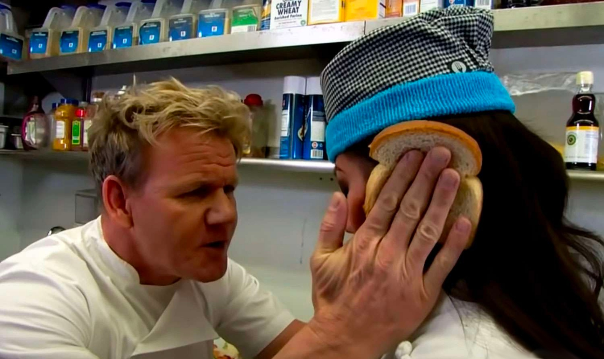

# Relatability

People remember **funny**, **relevant**, or **relatable** things way more than abstract definitions.  
Want someone to understand _anything_ you're teaching?  
**Relate it to them.** It’s that simple.

### 💡 What this means:

- Every topic should connect to **something real** – a meme, a pop culture reference, or a trending app.

- Use **analogies** to explain complex ideas (e.g., _“Neural networks are like making pancakes – lots of trial and error before you get it right”_).

- Make it **personal** – ask people about their experiences and how the topic relates to their lives.

### 🔍 Ask yourself:

✅ Can you **replace a boring** example with something **cooler**?  
✅ Is the **explanation fun** without being dumbed down?  
✅ Are you using **analogies** to make **complex ideas** easier to grasp?

### 🎯 Example:

**Instead of defining recommendation algorithms**, ask:  
_“What’s the weirdest thing YouTube has ever recommended to you?”_

Then, explain how AI tracks user behaviour to push content.  
For example, if you watch one Gordon Ramsay video, YouTube thinks you thrive on watching him lose his mind over raw chicken at 2 AM, as if your life depends on it. 😭😂🍗

<figure>
  
</figure>

### 🧪 Real-world examples

No exceptions – even the “technical” stuff should feel personal.

<figure>
  
  <figcaption><em>Example: Demonstrate the applications of AI via the YouTube algorithm and doomscrolling (AI Workshop)</em></figcaption>
</figure>

<figure>
  
  <figcaption><em>Example: Demonstrate the behaviours of CNNs by determining the difference between a clock and a compass (AI Workshop)</em></figcaption>
</figure>
