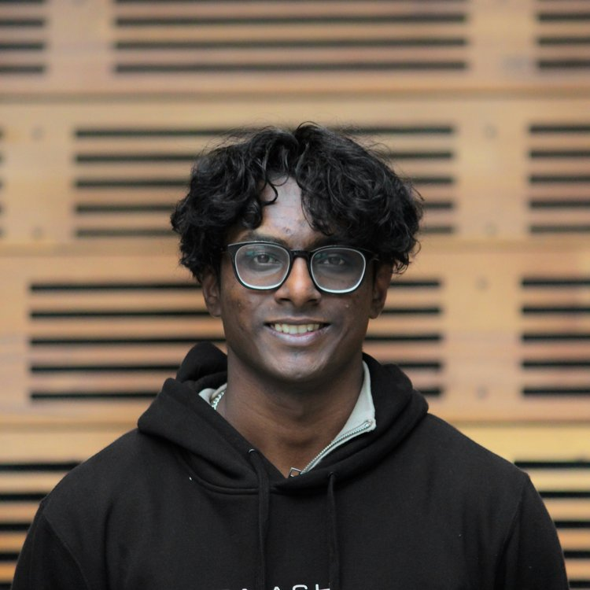
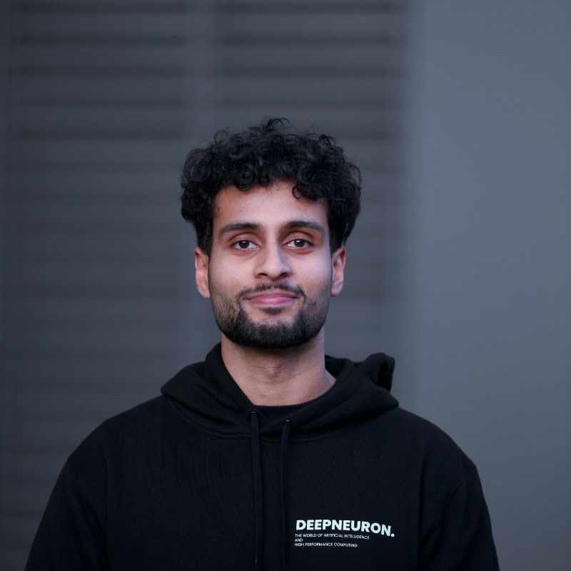

# FERAL Framework

Workshops at MDN aren’t just “sit-and-listen” sessions – we make them **interactive, engaging, and actually worth attending**. That’s where **FERAL** comes in.  
No, it’s not about going absolutely wild _(although, sometimes that happens hehe 😉)._

It’s about creating workshops that:  
✅ **Flow** seamlessly  
✅ **Engagement** with participants  
✅ **Relatablity** to real-life concepts  
✅ **Aesthetically** beautiful  
✅ **Legacy** create

And why do we do it? Because **education is more than just delivering information** – it’s about making an impact.

As **your Education Leads**, here’s what drives us:

  
  

    
💬 <em>"One of the major highlights of teaching is witnessing that 'Aha!' moment on a student’s face. It’s absolutely priceless to see someone transition from confusion to understanding – from ‘what on earth is this?’ to ‘I actually get it now.’ That’s exactly why I teach, and I know it resonates with many of us in this profession."</em>

    
<strong>– Shajana (Sarge)</strong>, Education Co-Lead

  

  
  

    
💬 <em>"I believe deep learning will be a cornerstone technology in solving some of our biggest problems, so the opportunity to turn something which is (seemingly) complicated into something tangible that students can understand is what makes MDN Education so amazing."</em>

    
<strong>– Jeevan</strong>, Education Co-Lead

  

This is why **FERAL** exists – it’s our way of ensuring that every MDN workshop is an **experience**, not just a lecture.

In our personal experience of curating workshops at MDN, we have distilled these **5 key criteria points** that outline what makes our workshops so great 🔥.

🚀 **Let’s break it down.** 👇
