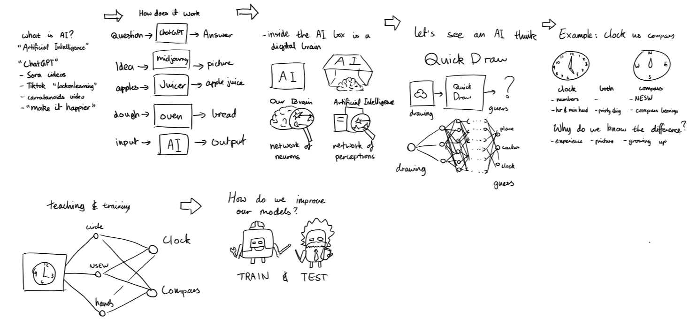
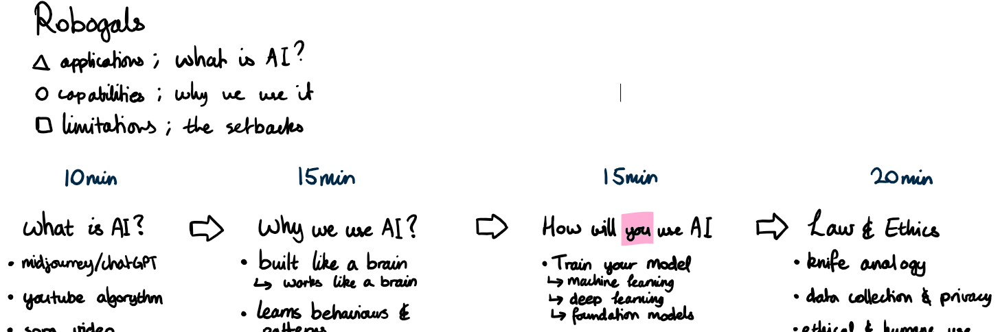
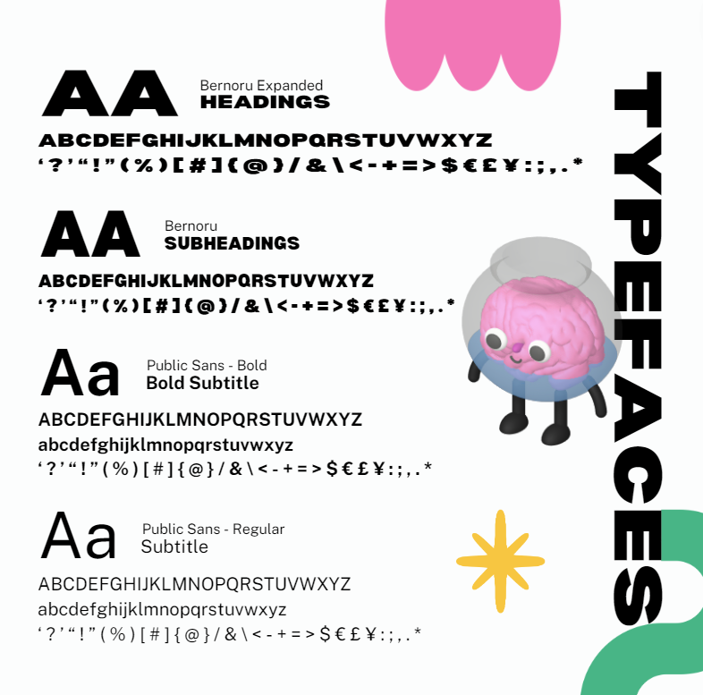

# FERAL Framework

Now that we have the idea behind what our workshop should achieve, let's narrow down on how we're going to curate our content to get there.

Through all our experience, we've distilled what we believe are the 5 key points which underpin a great workshop.

# Make your workshops FERAL

## **Flow**

Each section of the workshop leads into the following sections smoothly; the workshop follows the patterns of a narrative.

Don't think about the workshop as separate parts you join together, think about it as a narrative/story, which you fill in.

<figure>
  
  <figcaption>Example of planning the flow of workshop with preliminary schematics</figcaption>
</figure>

<figure>
  
  <figcaption>real example of workshop with high school students.</figcaption>
</figure>

## Engagement

As a rule of thumb:
> At least 1/3 of the entire workshop should be purely practical activities

There are obviously exceptions, but generally, 1:2 ratio between listening and action should occur.

We want participants to be actively engaged during these activities. 

<figure>
  
  <figcaption>Example: Demonstrate supervised learning with an online model (AI Workshop)</figcaption>
</figure>

<figure>
  
  <figcaption>Example: Doing a scavenger hunt for particular pre-trained models on hugging face (AI Workshop)</figcaption>
</figure>

## Relatability

As a rule of thumb:
> Each and every new idea displayed in your workshop is associated with either an analogy, relatable example, or media reference

No exceptions.

<figure>
  
  <figcaption>Example: Demonstrate the applications of AI via the youtube algorithm and doomscrolling (AI Workshop)</figcaption>
</figure>

<figure>
  
  <figcaption>Example: Demonstrate the behaviours of CNNs by determining the difference between a clock and a compass (AI Workshop)</figcaption>
</figure>

## Aesthetic

This is what really separates us from the pack.

Later on in the booklet, there is greater detail with regards to how specifically we achieve this. 

Here are the guiding principles:

Each and every slide follows the same design language, as referenced by a design guidelines document.

At MDN, you use the MDN Branding kit.

<!-- Add link here skrrr -->

<figure>
  
  <figcaption>Example: Utilizing assets and graphics MDN branding kit (animated in powerpoint btw) (AI Workshop)</figcaption>
</figure>

<figure>
  
  <figcaption>Example: Following the font size and style guidelines from the MDN branding kit (AI Workshop)</figcaption>
</figure>

<figure>
  
  <figcaption>Example: Typeface guide as specified by the VicHack 2024 branding kit </figcaption>
</figure>

<figure>
  
  <figcaption>Example: Asset library as provided in the VicHack branding kit </figcaption>
</figure>

## **Legacy**

Under the guise of the 4 aforementioned principles, students are left impressed and imprinted of the workshop; make this workshop one not worth forgetting.

<!-- Add images?? -->

> If your workshop was good, you SHOULD have people you've never met before staying back afterwards chatting to you.