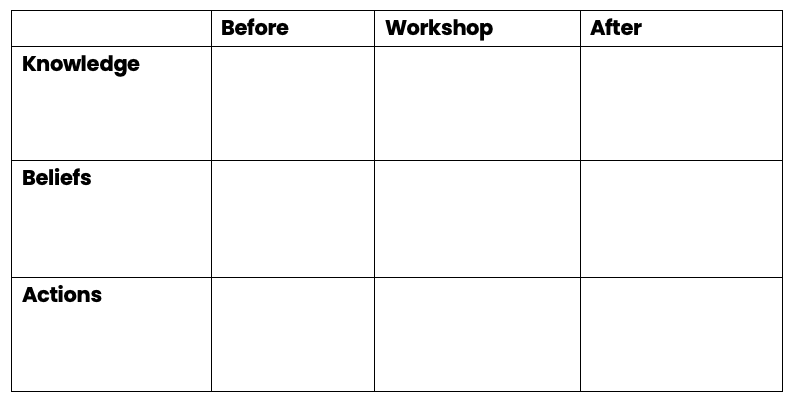

# Journey Framework

Putting the theory in practice from the previous sections, we now have a structured framework we can use when planning our workshops:

<figure>
  
  <figcaption>Journey Framework Template.</figcaption>
</figure>

Use this when planning for workshops.

It follows a simple input, processes, output structure.