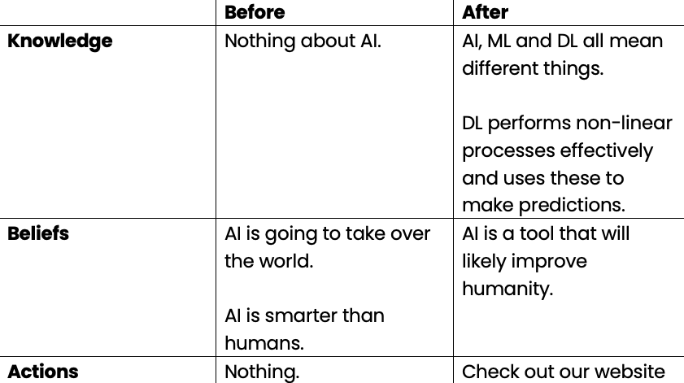

# The Journey

## Don’t inform, take them on a journey

This is likely the biggest paradigm shift you will encounter in the MDN Education team.

We don’t believe our goal is to inform.

We believe our goal is to inspire (i.e. arouse interest).

This was covered in depth in our philosophy section, but we believe that after our workshop/s, attendees should feel inspired about AI/HPC. 

Consequently, our goal is behaviour change, not technically education (as its defined commonly).

<figure>
  
</figure>

This is entirely about creating an emotional experience.

To create this emotional experience, we must take them on a journey. 

To plan this journey, we must consider what the audience was like prior to the event, and what we would like them to be like after the event. 

More specifically, we want to narrow our understanding of their:

- **Knowledge**
- **Beliefs**
- **Actions**

We want to then plan our workshop/s such that after, they have a different set of knowledge, beliefs and actions.

<figure>
  
  <figcaption>Example for high school 'Intro to AI' workshop.</figcaption>
</figure>

The actions don’t need to be super sophisticated. 

So, we’ve identified where they are before the workshop and where we’d like them to be. It is from here that we flesh out the content for the workshop.

This content has the singular goal of taking our audience on a journey to achieve the desired ‘after’ state.