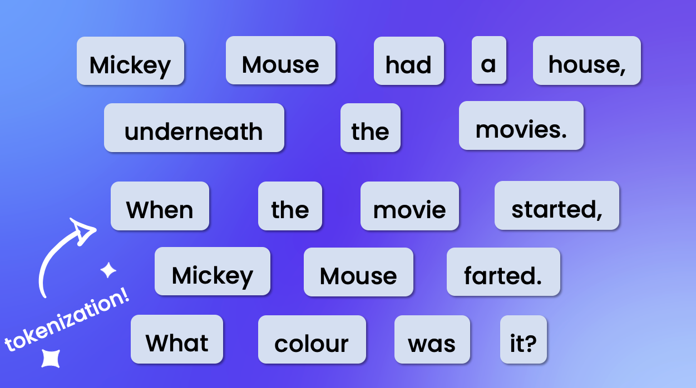
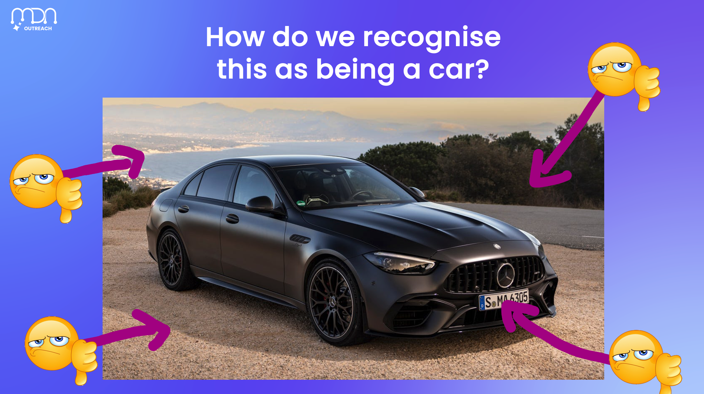

# The Speaker

## Your audience is there for YOU, not the content.

This seems false, especially for Tylers and Nyans, but think about it.

Information is free and abundant. It takes them 0.00003 seconds to get thousands of resources on AI and HPC.

They are at this workshop, because the hope is that you, yes YOU, are able to **organise this information** in a way that’s meaningful to them. 

This leads to an interesting natural logical consequence…

No one else should be able to present the workshop like you do.

I don’t mean that in a corny, you’re a special snowflake way. 

I mean that you should organise the information in a way that is relevant to you as a person. References, memes, stories, why YOU care.

<figure>
  
  <figcaption>Primary school chant used in example to explain NLP.</figcaption>
</figure>

<figure>
  
  <figcaption>Reference to famous car amongst car enthusiast (2024 AMG C63).</figcaption>
</figure>

So before you approach any workshop, consider how you are going to use your knowledge and experiences to make it unique. Things to consider:

- Your experiences (internships, classes etc)
- Your projects
- Hobbies
- References/memes etc