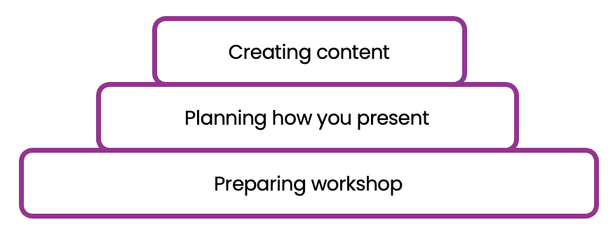

# Workshop preparation

### Prior preparation prevents poor performance

When 99% of people approach presenting a workshop, the first thing they do in preparation is create a rough outline of what they'd like to discuss with no real framework in mind.

Whilst this is ok, we can do wayyyyyy better.

In our experience presenting at MDN, we've fleshed out a methodology to preparing our workshops to ensure they're cohesive and most importantly, engaging. 

This probably the most important chapter in this book as it forms the foundation for what you're actually presenting.

<figure>
  
</figure>

With a bad foundation, no matter how cool your PowerPoint looks, literally no one will care. 

These frameworks have yielded us great success, and we hope it does the same for you ❤️.

---

Much of the content in this workshop is adapted from:
- [Phil Waknell: 3 Magic Ingredients of Amazing Presentations](https://www.youtube.com/watch?v=yoD8RMq2OkU)
